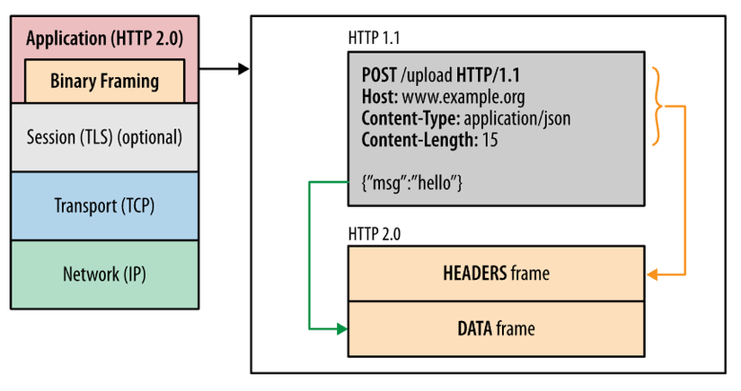
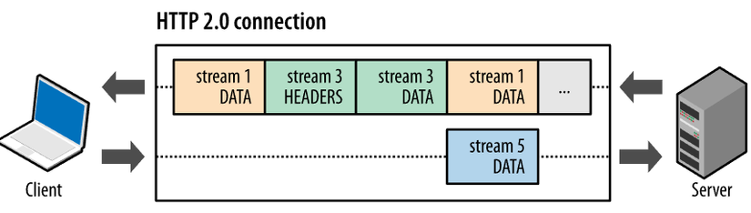

# Training_HttpRequest_PostMan

## I. Cấu trúc của Http message

### 1. Các khái niệm

### a. Tổng quan

Http message là cách mà data chuyển giữa người dùng và server. Có 2 loại message:

-  **request**: gửi bởi người dùng tới server để trigger 1 action nào đó

- **responses**: kết quả trả về từ server

Http request và response có chung cấu trúc như sau:

- **start-line**: miêu tả request để thực hiện (GET, POST, PUT, ...), trạng thái thành công hay thất bại (qua các mã code)

- **HTTP headers**: có thể có hoặc không, chứa các thông tin của request (host, content-length, encoding, ...)  hoặc miêu tả phần body của message

- **Dòng kẻ trống**: một dòng trống cho biết tất cả thông tin meta cho yêu cầu đã được gửi.

- **body**: Phần thân tùy chọn chứa dữ liệu được liên kết với r (như nội dung của biểu mẫu HTML) hoặc tài liệu được liên kết với reponse.

Sự hiện diện của cơ thể và kích thước của nó được chỉ định bởi các tiêu đề bắt đầu và HTTP.


start-line + HTTP headers = head của r
equest


### b. Http requests

- **Start-line** gồm 3 thành phần: 

+ HTTP method (như GET, PUT, POST, HEAD, OPTIONS, ...): miêu tả hành động sẽ được thực hiện

Ví dụ: GET là lấy dữ liệu từ server, POST là gửi dữ liệu lên server

+ **Request target**: mục tiêu request, thường là URL, hoặc đường dẫn của giao thức, cổng, ...

```
POST / HTTP/1.1
GET /background.png HTTP/1.0
HEAD /test.html?query=alibaba HTTP/1.1
GET http://developer.mozilla.org/en-US/docs/Web/HTTP/Messages HTTP/1.1
```

+ **Phiên bản HTTP**:  định nghĩa cấu trúc còn lại của message, cũng là phiên bản của reponse trả về

- **HTTP headers**: cấu trúc dạng key : value, có thể được chia thành nhiều nhóm:

+ **General headers**: áp dụng cho cả message request và response, ko liên quan gì đến data được truyền trong body

Ví dụ: Connection: keep-alive: kiểm soát xem kết nối mạng có mở hay không sau khi giao dịch hiện tại kết thúc.

 Nếu giá trị được gửi là keep-alive, kết nối vẫn tồn tại và không bị đóng, cho phép các yêu cầu tiếp theo đến cùng một máy chủ được thực hiện.

Ngoài ra còn Upgrade-Insecure-Requests: 1equest

+ **Request headers**: như  User-Agent, Accept-Type, sửa request bằng việc chỉ định rõ hơn, đưa ra context (như Referer), ...

+ **Entity headers**: như Content-Length, áp dụng cho body của request


- **Body**: không phải request nào cũng có body, request lấy dữ liệu về như GET, HEAD, DELETE, OPTIONS thường không có. Request gửi data tới server
để update nó như POST thì có

Body được chia làm 2 loại:

Body 1 resource: gồm 1 file đơn lẻ, định nghĩa bởi 2 headers: Content-Type, Content_length

Multiple-resource bodies: gồm một multipart body, mỗi cái bao gồm những bit khác nhau của thông thường

### c. Http resp

- **Start-line** gồm 3 thành phần: 

+ Protocol version: thường là HTTP/1.1

+ status code: code trả về từ server

+ status text: miêu tả status code

Ví dụ: HTTP/1.1 404 Not Found.

- **Headers**: cấu trúc dạng key : value

Có 3 nhóm:

- **General headers**: áp dụng cho cả message 

- **Response headers**: bổ thêm thông tin về server 

- **Entity headers**: áp dụng tới body của reponse, như Content-Length


- **Body**: không phải response nào cũng có, response với status code 201, 204 thường không có

Có 3 loại:

+ Body 1 resource: gồm 1 file đơn lẻ biết trước kích thước, định nghĩa bởi 2 headers: Content-Type(chỉ loại media của tài nguyên - MIME types), Content_length

+ Body 1 resource: gồm 1 file đơn lẻ không biết trước kích thước, mã hóa bởi các mảnh bằng Transfer-Encoding

+ Multiple-resource bodies: gồm một multipart body, mỗi cái chứa những thông tin khác nhau, rất hiếm tồn tại

### d. HTTP/2 Frames

- HTTP/1.x có một vài nhược điểm về hiệu suất:

+ Header, không giống như body, không nén được

+ Header thường giống nhau giữa các message, và nó cũng bị lăp lại giữa các kết nối

+ Không ghép kênh có thể được thực hiện, nhiều kết nối cần mở trên cùng 1 server.

HTTP/2 thêm tính năng: nó chia HTTP/1.x message thành các frame mà sẽ được gắn vào 1 luồng. Dữ liệu và header frame được tách ra, điều này giúp header nén được. 



Nhiều luồng có thể được kết hợp với nhau, giúp tạo ra ghép kênh, tối ưu sử dụng băng thông, tiết kiệm thời gian




